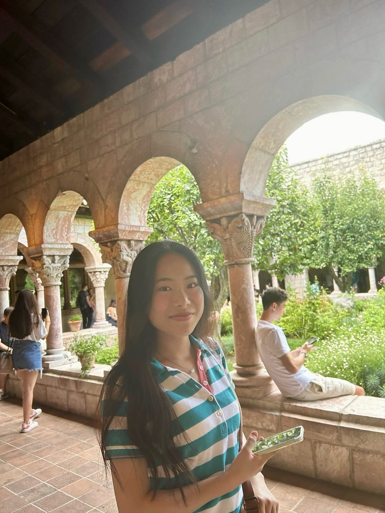

# Welcome to My GitHub Pages Site 🌐

# Education
## Tokyo Metropolitan Tachikawa Kokusai Secondary Education School - High School Diploma  
2017/4 - 2023/3  

## The University of Tokyo - Undergraduate  
2023/4 - 2023/8  
Trilingual Program in Chinese: Chosen for a selective language program, only offered to students in the top 10 percent in English proficiency in the university and belonged to the Chinese section of this program, which provided intensive Chinese learning courses.  
Rugby Football Club: Staff

## Columbia University in the City of New York - Undergraduate  
2023/9 - present  
Computational Biology major

# Skills
Technical: Dot Blot, ELISA, Cytoscape, C, Java, Python, Blender, Image Studio, ImageJ (FIJI)  
Language: Japanese (native), English (bilingual proficiency), Chinese (introductory level)  

# Interest
Environmental Science: evolutionary biology, primatology, botany  
Biology: neurodegenerative diseases, cancer, genomic research  
Computer Science: bioinformatics, computational biology  
Public Policy: public policy about science, science ethics, women’s empowerment [Op-Ed:Women Should Not Give Up on Both: Being Mothers and Scientists](https://docs.google.com/document/d/14m0owvIFjNlr56inRgWmZuqNy70tAxLMsm8QdFwKPt8/edit?usp=sharing) 

# Awards
## Yanai Tadashi Scholarship
Scholarship which covers university expenses of up to 100K USD/year for 4 years by Yanai Tadashi, the founder and president of UNIQLO. 

## Rabi Scholar
Chosen for Columbia College’s one of the most selective programs, awarded to approximately 10 most promising students each year for extraordinary achievements as scientists and mathematicians.

# Projects
- Research Assistant (2024/1 - present) at Columbia's Mortimer B. Zuckerman Mind Brain and Behavior Institute  
Working at Fitzpatrick lab, which explores the molecular and structural basis of neurodegeneration and memory using cryo-electron microscopy with complementary biophysical techniques (proteomics, light-microscopy, microfluidics.) In the lab, our team tries to determine the structure and behavior of amyloid fibrils, purified directly from postmortem human brain tissue, that are implicated in a range of neurodegenerative diseases and explore their interactome.  

- Full-time Summer Research Assistant (2024/5 - 2024/8)  
Funded by the Rabi Scholars Office of Columbia, working full time for Fitzpatrick Lab at Zuckerman Institute and studying a disease called Preeclampsia. Preeclampsia is known as a leading cause of maternal and fetal mortality, characterized by its possibility of sudden progression to severe stages. Recent studies have shown that in the urine of women with preeclampsia, a protein called uromodulin excesses with the presence of amyloid fibril formation. This research aims to establish a new biomarker to diagnose preeclampsia in the earlier stage by quantifying changes in the amount of uromodulin and amyloid fibrils that appear in the urine across various stages of preeclampsia throughout gestation.  

- Sapient (undergraduate journal of biological anthropology ), Illustrator/editorial board (2024/1 - present)  
Columbia University’s student-led scientific journal for biological anthropology. I work as a member of the editorial board and as an illustrator. Issued the journal vol.11 as a member of the editorial board. Drew the back cover art.  
Website: [Sapient](https://www.sapientjournal.com/)  

- Secretarial Assistant at the Members’ Office Building of the House of Councilors, Japan (2024/8)  
I worked as a secretarial assistant at the office of Keichiro Asao, the Minister of the Environment, and the Minister of State for Special Missions in Japan.  

- Atelier Basi Volunteer Mentor (2023/7 - present)  
Mentoring high school students who desire to attend universities abroad as a volunteer mentor.  

